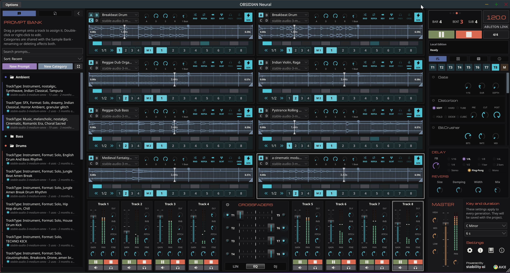

# OBSIDIAN-Neural

### Related Repositories

| Repository                                                                              | Description                                  |
| --------------------------------------------------------------------------------------- | -------------------------------------------- |
| [obsidian-neural-central](https://github.com/innermost47/obsidian-neural-central)       | Central inference server                     |
| [obsidian-neural-provider](https://github.com/innermost47/obsidian-neural-provider)     | Provider kit - run a GPU node on the network |
| [obsidian-neural-frontend](https://github.com/innermost47/obsidian-neural-frontend)     | Storefront & dashboard                       |
| [obsidian-neural-controller](https://github.com/innermost47/obsidian-neural-controller) | Mobile MIDI controller app                   |
| **[ai-dj](https://github.com/innermost47/ai-dj)** ← you are here                        | VST3 / AU / Standalone                       |
| [raveMorph](https://github.com/innermost47/raveMorph)                                   | Neural sound morphing plugin (RAVE-based)    |
| [beatcrafter](https://github.com/innermost47/beatcrafter)                               | MIDI drum sequencer VST                      |

## AI music generation for live performance - VST3, AU, Standalone

<div align="center">
    
    <p><i>Live AI music generation. Standalone or in your DAW (VST3 / AU).</i></p>
</div>

---

> _"I've cycled through almost every AI music tool on the market, but Obsidian is the first one that actually feels like a **real production tool** rather than a novelty. While other AI apps try to replace the songwriter, Obsidian treats AI like a powerful, playable instrument. The 8-track MIDI-triggering is a total game-changer. Because it lives directly in my DAW, there is **zero latency** and zero break in my workflow. It stays perfectly locked to my project's tempo and vibe, serving as the ultimate **intelligent jam partner VST**."_
>
> **- Moteka, Electronic Music Producer**
> [SoundCloud](https://soundcloud.com/moteka) · [Instagram](https://www.instagram.com/pmoteka/)

---

## 🆕 Local Edition (CPU, 100% offline)

A new **Local Edition** is on the way: **Stable Audio 3 Medium running entirely on your own CPU** — no GPU, no cloud, no internet required after a one-time setup. Pay once, play offline forever. The AI generates loops directly on your machine, and nothing ever leaves your computer.

It can also switch to server mode for the full 9-engine lineup (subscription or self-hosted).

**🧪 Limited slots.**
Beta testers get **free access** to the Local Edition. If you want in:

→ **[Become a beta tester](https://obsidian-neural.com/local.php)**

> ⚡ Runs on a standard CPU. Reference: ~11s per generation on a recent laptop CPU, alongside a full DAW session.
> 🍎 macOS: Apple Silicon (M1+) only — Intel Macs not supported.

---

## Two ways to run the AI

OBSIDIAN Neural is the same plugin, with two ways to generate audio:

| Mode                    | How generation runs                                 | Internet        | Engines               |
| ----------------------- | --------------------------------------------------- | --------------- | --------------------- |
| **Local Edition** (new) | On your own CPU, fully offline                      | Once, for setup | Stable Audio 3 Medium |
| **Cloud / Server**      | On a server (mine via subscription, or self-hosted) | Required        | All 9 engines         |

- **Local Edition** — a one-time purchase. The model runs on your machine, no subscription, no credits. Best for live performers and anyone who wants total autonomy. _(Currently in beta — see above.)_
- **Cloud / Server** — the free open-source plugin runs in server mode. Start free with 20 credits, then generation requires a subscription — or self-host the whole stack yourself.

---

## What OBSIDIAN Neural does

Type words → Get musical loops in ~30s. No stopping your creative flow.

### Performance

- **8-track sampler** with MIDI triggering (C3-B3)
- **4 pages per track** (A/B/C/D) - Switch variations instantly
- **8 sequences per page** - 256 total patterns for complex live sets
- **16-step sequencer** with multi-measure support
- **Quantized page changes** - Seamless transitions locked to measure boundaries
- **4 pair crossfaders with master bypass** - Blend each deck A/B pair independently with model-aware color morphing, or toggle the entire crossfader section off for direct routing
- **Plug-and-play MIDI mapping** - Auto-configured for the [companion mobile controller](https://github.com/innermost47/obsidian-neural-controller), with bidirectional feedback (LED states, knob positions) on dedicated MIDI channels.
  _To use: open the MIDI panel (piano icon, bottom-right) → Load Default Mapping._
- **MIDI learn on every parameter** - Map any control to any hardware override, with persistent user mappings

### Sound design

- **Per-page ADSR envelope** - Shape the dynamics of each variation independently, editable directly on the waveform
- **Per-track gain control** - Adjust each sample's level (-12 / +12 dB) before mixing, with visual waveform feedback
- **Per-track reverse** - Instantly flip any page's playback direction for reversed textures and risers
- **Per-track transient scatter** - Randomize and reposition transients for glitchy, stuttering rhythmic variations
- **Per-track multi-mode filter** - LP/HP/BP with 12 or 24 dB slopes, drive, cutoff and resonance for sculpting each voice
- **Per-track 8-band graphic EQ + master EQ** - Independent frequency shaping on every voice and global bus, from 40 Hz to 15 kHz
- **Per-track compressor + master compressor** - Full dynamic control on each voice and on the master bus, with threshold, ratio, attack, release and makeup gain
- **Per-track limiter + master limiter** - Peak protection on every voice and on the master bus with adjustable release and ceiling
- **Per-track distortion** - 6 character modes (Soft, Hard, Tube, Fold, Diode, Cubic) with pre/post gain and high-pass cutoff
- **Per-track bitcrusher** - Bit depth and sample rate reduction for lo-fi, digital degradation
- **Per-track chorus** - Modulation effect with rate, depth, delay, feedback and dry/wet control for added stereo width
- **Per-track phaser** - Sweeping notch modulation with rate, depth, feedback and stages for movement and width
- **Per-track flanger** - Classic jet-swoosh modulation with rate, depth, feedback and delay control
- **Tempo-synced delay send** - 8 time divisions (1/16 to 2 bars), Stereo / Ping-Pong / Mono modes, per-track send level
- **Reverb send** - Per-track reverb with size, damping, width and mix controls
- **Airwindows Console6 master bus** - Analog-modeled saturation for cohesive mix glue

### AI generation

- **Prompt bank with editor** - Build, organize and reuse your prompts with model-aware keywords (genres, elements, moods, negatives)
- **Drag-and-drop prompts** - Drop a prompt on a track to assign both prompt and AI model in one gesture
- **Sample bank with drag-and-drop** - Every generation is automatically saved and can be reused across tracks and projects
- **Non-blocking generation** - No pre-recorded samples, renders in background

### Multi-model engine

In **server mode**, OBSIDIAN Neural offers **9 specialized AI engines** - assign a different one to each track for its strengths:

1. **stable-audio-open-1.0** - Versatile foundation, drums and full-mix textures (80–160 BPM)
2. **Stable Audio 3 Medium** - Next-gen flexible full tracks, isolated stems, FX (80–160 BPM) _(also the local engine)_
3. **Foundation-1** - Tag-based melodic and harmonic phrasing (100–150 BPM)
4. **Audialab EDM Elements** - High-energy EDM leads, supersaws, plucks (100–150 BPM)
5. **RC Infinite Pianos** - Grand and electric piano performances (100–150 BPM)
6. **RC Vocal Textures** - Choral, operatic and atmospheric vocals (100–150 BPM)
7. **SAO Instrumental** - Melodic trap, lofi jazz rap, indie stems (75–160 BPM)
8. **StableBeaT** - Trap beats and 808 grooves (75–160 BPM)
9. **gluten_v1** - Loopable melodic trap and wavy motifs (90–160 BPM)

The **Local Edition** runs **Stable Audio 3 Medium** on your CPU. The other 8 engines are available in server mode.

> ⚠️ AI generation can produce unexpected results. Feedback welcome on [Issues](https://github.com/innermost47/ai-dj/issues) or [Discussions](https://github.com/innermost47/ai-dj/discussions).

### DAW & Standalone

- **Automatic tempo sync** - Incoming samples are BPM-detected with [MiniBPM](https://breakfastquay.com/minibpm/) and time-stretched on load via [Signalsmith](https://github.com/Signalsmith-Audio/signalsmith-stretch) Stretch to lock to your host tempo, with zero pitch drift
- **Standalone version** - Run OBSIDIAN Neural without a DAW, with built-in transport and tempo control
- **Ableton Link** (Standalone) - Bidirectional network sync of tempo and start/stop with any Link-enabled app

**OBSIDIAN Neural is NOT a song generator** like Suno or Udio. It's a performance tool: you build your track loop by loop, you're the composer, AI is your loop generator.

---

### Windows: low-latency audio

For best performance and sync accuracy with Ableton Link, select
**"Windows Audio (Exclusive Mode)"** in the audio settings, then your
audio interface. The default shared mode adds 20-50ms of latency.

If you have ASIO drivers from your audio interface vendor, those will
work even better - but require a separate build with the Steinberg
ASIO SDK (not redistributable).

---

## Quick Start

Pick the mode that fits how you work:

### 💻 Local Edition (beta) — runs on your CPU, offline

1. [Become a beta tester](https://obsidian-neural.com/local.php) to get free access (limited slots)
2. Receive your license key by email, download the installer
3. Activate once + download the model — then it runs fully offline

### ☁️ Cloud / Server mode — runs on a server

1. Download the plugin from [Releases](https://github.com/innermost47/ai-dj/releases)
2. Get your API key from [obsidian-neural.com](https://obsidian-neural.com)
3. Load the VST in your DAW → Settings → Enter Server URL + API key

**Cloud pricing:**

| Plan    | Price        | Credits/month |
| ------- | ------------ | ------------- |
| Free    | -            | 20 samples    |
| Base    | €7.99/month  | 150 samples   |
| Starter | €11.99/month | 300 samples   |
| Pro     | €14.99/month | 500 samples   |

---

## Download

| Platform           | Install path                            |
| ------------------ | --------------------------------------- |
| Windows VST3       | `C:\Program Files\Common Files\VST3\`   |
| Windows Standalone | Run `OBSIDIAN-Neural.exe` from anywhere |
| macOS VST3         | `~/Library/Audio/Plug-Ins/VST3/`        |
| macOS AU           | `~/Library/Audio/Plug-Ins/Components/`  |
| macOS Standalone   | `/Applications/` (drag the `.app`)      |
| Linux VST3         | `~/.vst3/`                              |
| Linux Standalone   | Run the binary from anywhere            |

→ **[Download from Releases](https://github.com/innermost47/ai-dj/releases)**

---

## How it works - The Distributed GPU Network

In **server mode**, OBSIDIAN Neural can run on a **distributed GPU provider network**. When you generate a loop, the request is routed to an available community provider. If none is available, the system falls back to a cloud inference service.

```
VST Plugin → Central server → Provider GPU pool → WAV returned to DAW
                                    ↓ if unavailable
                               Cloud inference fallback
```

**Revenue sharing - full transparency:**
Subscription revenue is redistributed **strictly equally** among all eligible providers each month via Stripe Connect, after a 15% platform fee covering infrastructure costs. Redistribution history is public:

**[obsidian-neural.com/public.php](https://obsidian-neural.com/public.php)**

No authentication required. No data is ever deleted.

**Provider eligibility:**

- Uptime score ≥ 80% (based on random unpredictable pings)
- At least 1 real job processed during the month

**🚀 I'm looking for my first 10 GPU providers.**
If you have a GPU and want to earn a share of the monthly revenue while supporting an open-source project: → **[Provider kit](https://github.com/innermost47/obsidian-neural-provider)**

> Note: The Local Edition runs independently of this network — it generates on your own CPU and doesn't need any provider or server.

---

## Community

📧 [Contact](https://obsidian-neural.com/contact.php) · 💬 [GitHub Discussions](https://github.com/innermost47/ai-dj/discussions) · 🌐 [obsidian-neural.com](https://obsidian-neural.com)

---

## More Projects

🥁 **[BeatCrafter](https://github.com/innermost47/beatcrafter)** - Intelligent MIDI drum pattern generator VST3
🎛️ **[Randomizer](https://randomizer.anthony-charretier.fr/)** - Generative music studio
🎵 **[YouTube](https://www.youtube.com/@innermost9675)** - Original compositions (electronic, ambient, metal, experimental)

---

## License

🆓 **GNU Affero General Public License v3.0** - Stability AI Community License for the AI model.

---

## Credits

**Developed by InnerMost47 (Anthony Charretier)**

Special thanks to **Moteka** for the testimonial and early adoption, Stability AI, and all beta testers.

---

_Made with 🎵 in France_

[](https://obsidian-neural.com)
[](LICENSE)
[](https://github.com/innermost47/ai-dj)
